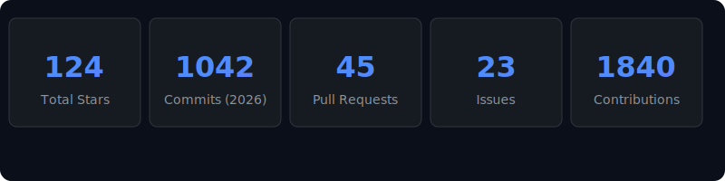

  
  
  
   

  <h2>⚙️ Tech Stack & Skills</h2>
  

   
  
  <h2>🚀 Featured Projects</h2>
  

   
  
  <h2>⏳ Timeline</h2>
  

   
  
  <h2>📊 GitHub Statistics</h2>
  

   
   
  
  <!-- Easter Egg: The command terminal hero shows boot sequences. Konami code hinted here in invisible/comment format -->
  <!-- sudo future -> "Building the future with AI." -->
  
  

